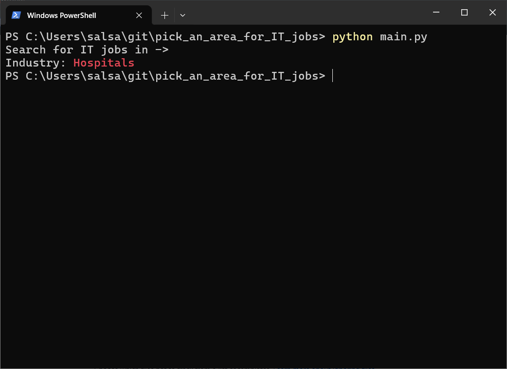
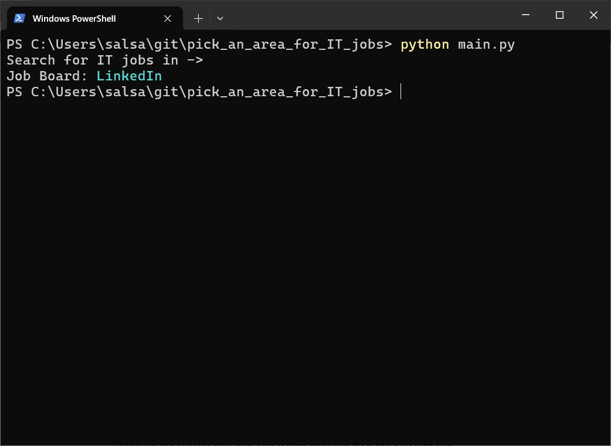

# pick_an_area_for_IT_jobs

A program to pick an area to search for IT jobs




Create virtual environment
```
python -m venv venv
```
Activate Python virtual environment on Windows
```
.\venv\Scripts\Activate.ps1
```

Install dependencies
```
pip install -r requirements.txt
```
